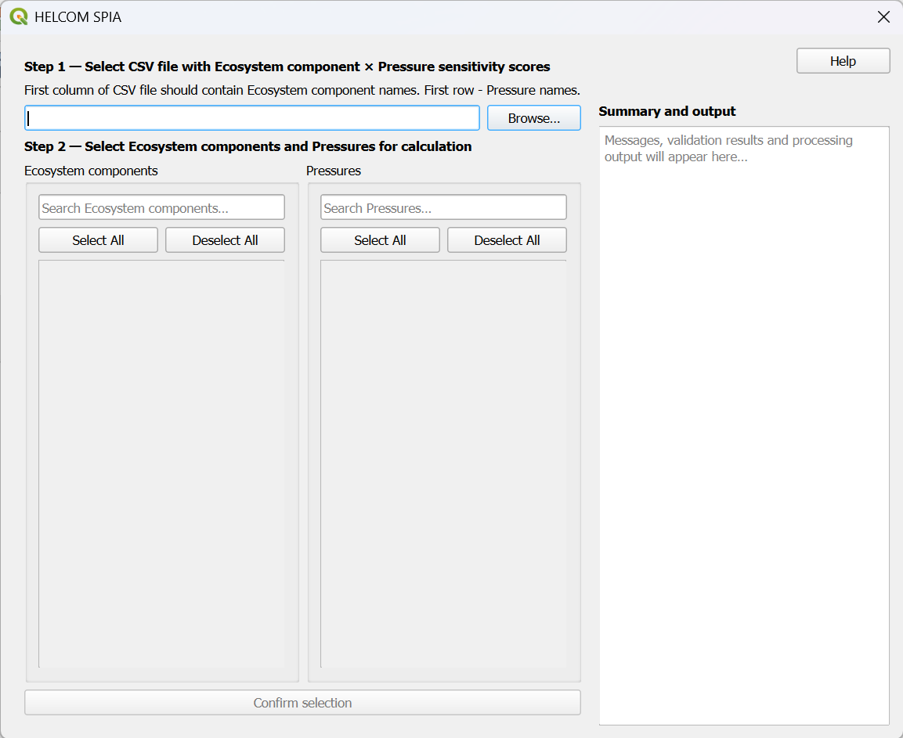
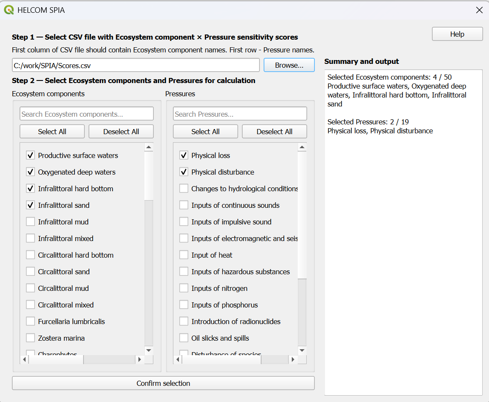
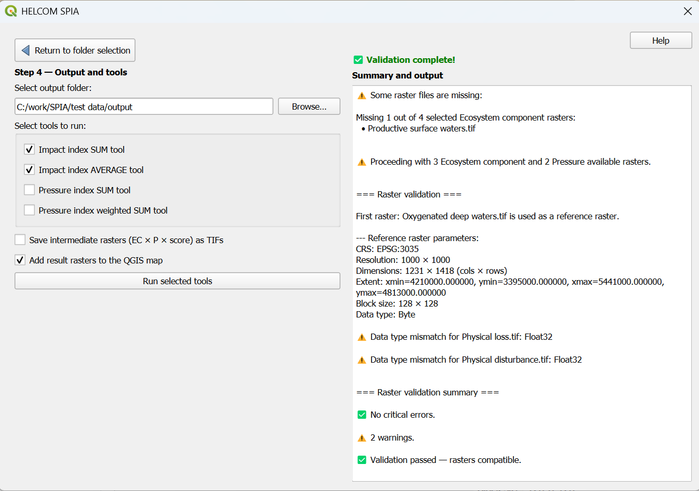

# HELCOM SPIA — User Guide

This guide provides step‑by‑step instructions for installing and using the HELCOM SPIA QGIS plugin.

👉 For general plugin information and features, see **README.md** in plugin Github repository https://github.com/helcomsecretariat/helcom-spia

---

# 📥 1. Getting the Plugin

1. Go to the plugin repository:  
   https://github.com/helcomsecretariat/helcom-spia

2. Download the plugin from **Releases**:
   Releases → HELCOMSPIA.zip
   
   ⚠️ Do NOT use *Code → Download ZIP* (it will not install properly in QGIS)

---

# ⚙️ 2. Installing the Plugin in QGIS

1. Open QGIS  
2. Go to:
   Plugins → Manage and Install Plugins → Install from ZIP
3. Select the downloaded `.zip` file  
4. Click **Install Plugin**  
5. Enable the plugin if needed  

---

# ▶️ 3. Starting the Plugin

1. Open QGIS  
2. Go to:
   Plugins → HELCOM SPIA
3. The plugin dialog will open  

---

# 🧭 4. Workflow Overview

The plugin follows a structured workflow:

1. Load EC×P sensitivity matrix (CSV)
2. Select Ecosystem Component (EC) and Pressure (P) raster folders
3. Validate raster datasets
4. Select tools and output folder
5. Run analysis
6. Review outputs

---

# 📊 5. Step‑by‑Step Instructions

---

## ✅ Step 1 — Load sensitivity score matrix (CSV)

- Click **Browse…**
- Select a CSV file containing EC×P scores

### CSV structure

- First row → Pressure names  
- First column → Ecosystem Component names  
- Values → sensitivity scores  

Example:

|     | Pressure 1 | Pressure 2 |
|-----|------------|------------|
| EC1 | 0.7        | 1.5        |
| EC2 | 0          | 2          |

---

## ✅ Step 2 — Select ECs and Ps

- Select checkboxes for:
- Ecosystem Components
- Pressures

Optional:
- Use search fields to filter
- Use **Select All / Deselect All**

✅ When at least one EC and one P are selected:
- **Confirm selection** button becomes available

---

## ✅ Step 3 — Confirm selection

Click:
   Confirm selection

- Selection summary appears on the right panel  
- Next step becomes available  

---

## ✅ Step 4 — Select raster folders

You must choose:

- Folder containing EC rasters  
- Folder containing P rasters  

Each folder must contain `.tif` files matching selected labels.

Example:
   Productive surface waters.tif
   Oxygenated deep waters.tif
   Physical loss.tif
   Physical disturbance.tif

---

## ✅ Step 5 — Validate raster inputs

Click:
   Validate rasters

Validation checks:

- File availability  
- CRS  
- Resolution  
- Dimensions  
- Extent  
- Data type  

---

### Possible outcomes

| Result | Meaning |
|------|--------|
| ✅ All good | Proceed |
| ⚠ Missing rasters | Can proceed with available |
| ❌ No matching rasters | Processing stops |
| ⚠ Warnings | Can proceed |
| ❌ Critical errors | Processing stops |

---

## ✅ Step 6 — Select tools and output folder

1. Select output folder  
2. Choose one or more tools  

### Available tools

- **Impact index SUM tool**  
- **Impact index AVERAGE tool**  
- **Pressure index SUM tool**  
- **Pressure index weighted SUM tool**

Each tool produces a different type of output raster.

---

### Output structure

The plugin creates a timestamped folder:
   SPIA-results-YYYY-MM-DD-HH-MM-SS

---

### Outputs

| Tool | Output raster | CSV |
|-----|--------------|-----|
| Impact index SUM | Impact-index-SUM-*.tif | ✅ |
| Impact index AVERAGE | Impact-index-AVERAGE-*.tif | ✅ |
| Pressure index SUM | Pressure-index-SUM-*.tif | |
| Pressure index weighted SUM | Pressure-index-weighted-SUM-*.tif | |

✅ CSV is shared by SUM and AVERAGE tools

---

### Optional setting

✅ **Add result rasters to the QGIS map**

- Checked → rasters added automatically  
- Unchecked → saved only to disk  

---

## ✅ Step 7 — Run processing

Click:
   Run selected tools

### During processing

- Progress bar shows progress  
- Estimated runtime is displayed  

---

### Cancel processing

Click:
   Cancel processing

- Processing stops safely  
- No incomplete outputs are written  

---

### After processing completes

- Output files are listed  
- Rasters are added to map (if enabled)  
- You can restart the workflow  

---

# 📁 6. Outputs

All outputs are saved in:
   SPIA-results-YYYY-MM-DD-HH-MM-SS

---

## Raster outputs

- Impact index SUM  
- Impact index AVERAGE  
- Pressure index SUM  
- Weighted Pressure index  

---

## CSV output

- Contribution matrix  
- Shared between Impact index SUM and Impact index AVERAGE tools  

---

# ⏱ 7. Performance Tips

- Tools Impact index SUM and Impact index AVERAGE share computation → faster together  
- Many and large datasets may take hours  
- Consider running long jobs overnight  

---

# ⚠️ 8. Common Issues

### No rasters found
- Check folder paths  
- Ensure filenames match CSV labels  

---

### Validation fails
- Ensure rasters share:
  - CRS
  - resolution
  - extent  

---

### Processing is slow
- Reduce number of ECs / Ps  
- Test with smaller datasets  

---

# ✅ 9. Best Practices

- Start with small datasets  
- Validate inputs before running  
- Use timestamped outputs for comparison  
- Keep naming consistent  

---

# 📘 10. Additional Resources

👉 For plugin overview:  
See **README.md**

👉 For updates and issues:  
https://github.com/helcomsecretariat/helcom-spia/issues

---

# ✅ End of Guide
